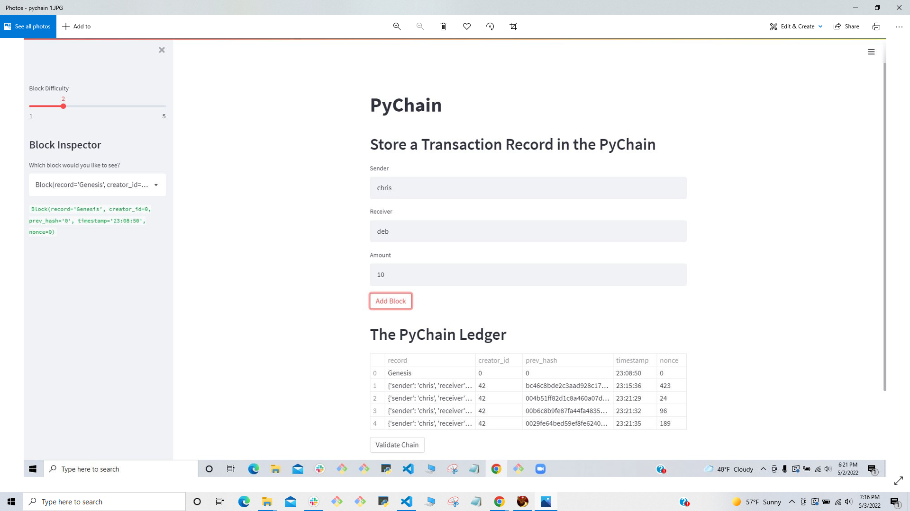
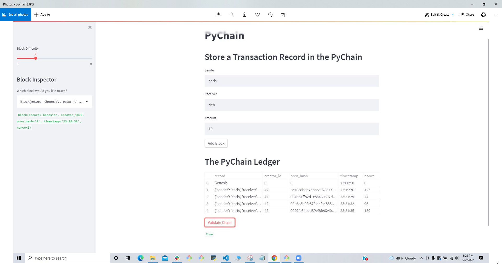

# pychain_ledger
HW19  Build a blockchain-based ledger system, complete with a user-friendly web interface.

This is the readme for my Pychain Ledger

To run the progran simply navigate to the file, and run hw18 with streamlit.

